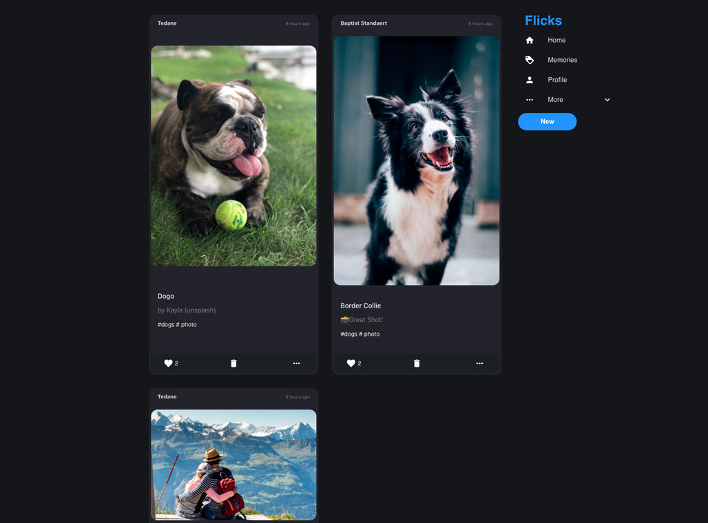
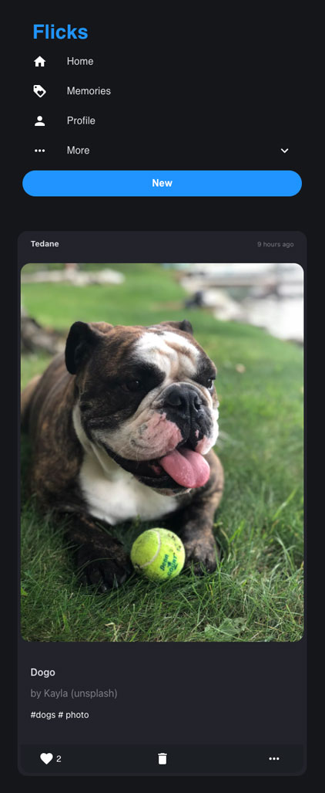

# React Social Medial App

## Functionality
- CRUD - Users can post, delete, edit, and view posts

## This is a social media app that was built using :

### Front end
- React (CRA)
   - Redux
   - Redux Thunk
   - API - Axios and JS Fetch API
   - [Hosted By Netlify](https://emandtedblake.netlify.app)
- Styled-Components
- Material UI

### Back end
- MongoDB
- Node 
- Express
   - Hosted by Heroku

- - - -

### [Demo](https://emandtedblake.netlify.app)
### Screen shots

